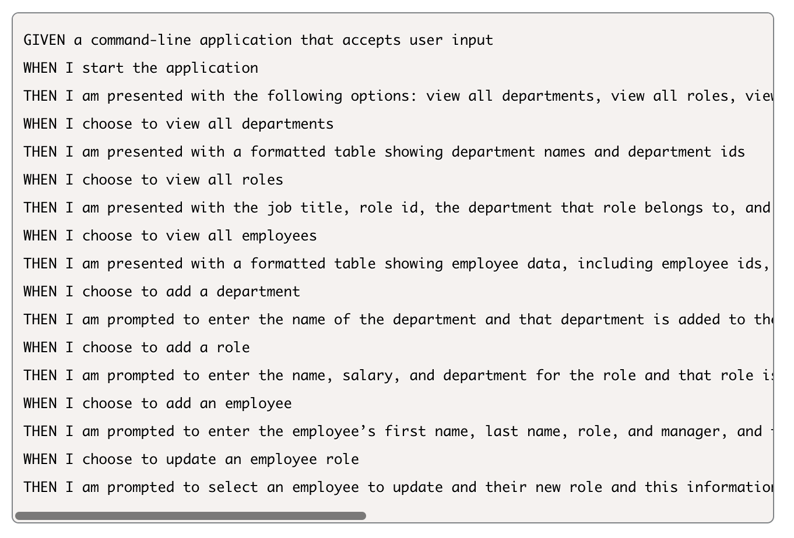
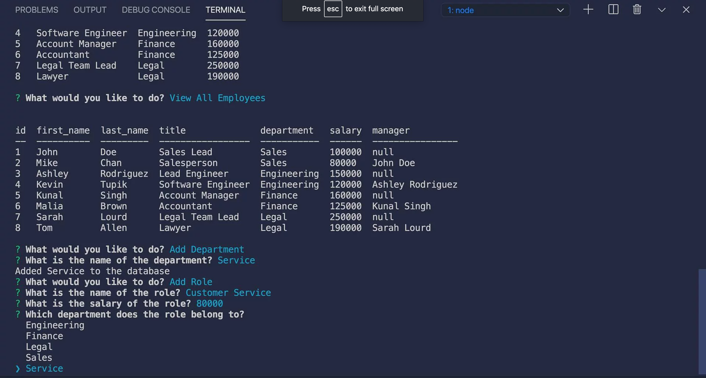

# Employee-Tracker :mag:

This Command-line tracking application was made to manage a company's employee database, using Node.js, Inquirer, and MySQL. User will be able to view and manage the departments, roles, and employees within their company to help with organization.

---

### **Steps to get started:**
```
- npm i (+ all dependencies)
- node index
```
---

### **Application Acceptance Criteria:**


### **Mock Up:**



---
### **Technology used:**
```
- Javascript
- Node.js
- MySQL
- Inquirer.js
```

---

### **Steps for future development:**
```
- Review Code & fix bugs to have a functioning backend (unknown database error code)
```
